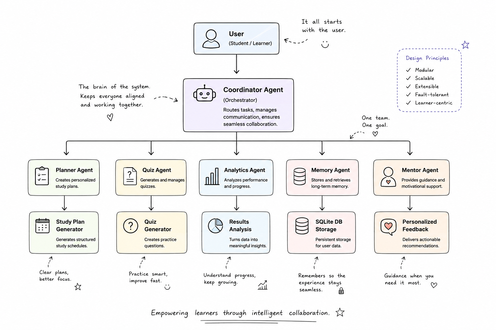
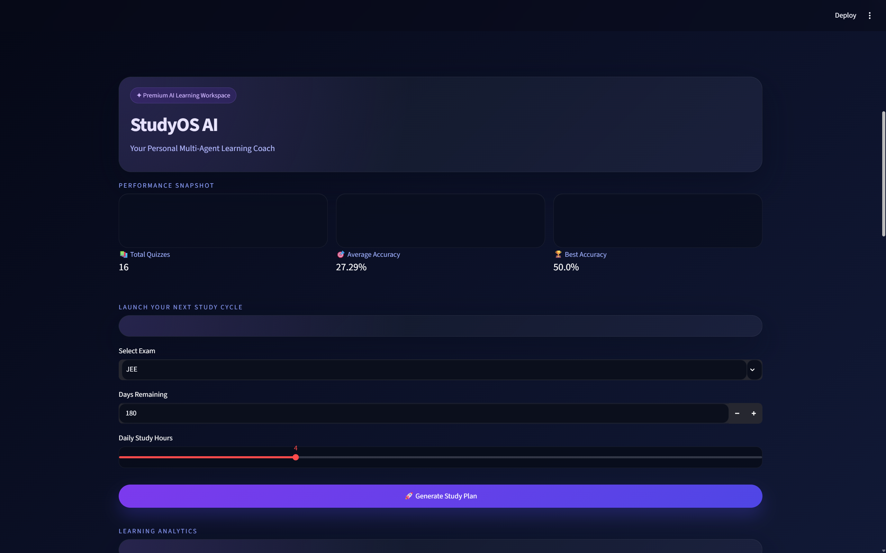
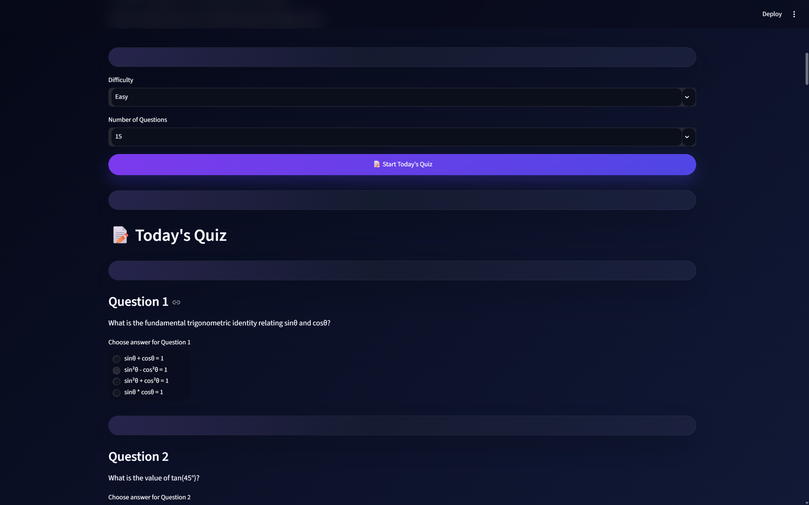
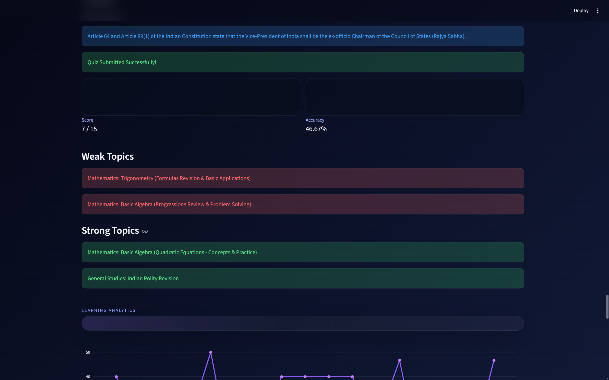

# 🎓 StudyOS AI

> **A Multi-Agent AI Learning Coach that generates personalized study plans, adaptive quizzes, performance analytics, long-term memory, and AI mentor feedback to help students learn more effectively.**

<p align="center">


</p>

---

## 🚀 Overview

StudyOS AI is an intelligent learning assistant built using a **Multi-Agent Architecture**.

Instead of relying on a single AI model to perform every task, StudyOS AI delegates responsibilities to specialized agents. Each agent focuses on a single responsibility, making the application modular, maintainable, and easier to extend.

The system assists students by:

- Generating personalized study roadmaps
- Creating topic-specific quizzes
- Tracking learning progress over time
- Persisting quiz history
- Identifying strengths and weaknesses
- Delivering personalized mentor feedback based on historical performance

The project demonstrates how multiple AI agents can collaborate to build a personalized educational experience.


# ✨ Features

## 📅 Personalized Study Planner

- AI-generated study roadmap
- Exam-specific planning
- Daily study schedule
- Topic recommendations

---

## 📝 AI Quiz Generator

- Dynamic question generation
- Adjustable difficulty
- Configurable number of questions
- Multiple-choice assessments

---

## 📊 Learning Analytics

- Quiz scoring
- Accuracy calculation
- Strong topic detection
- Weak topic detection
- Performance visualization

---

## 💾 Long-Term Memory

- Stores every quiz attempt
- Maintains learning history
- Tracks progress across sessions
- SQLite persistence

---

## 🤖 AI Mentor

- Reviews historical performance
- Detects learning patterns
- Identifies improvement areas
- Generates personalized study advice


## 🏗️ Architecture

<p align="center">

</p>


# 📂 Project Structure


StudyOS-AI/

│

├── agents/

│   ├── planner_agent.py

│   ├── quiz_agent.py

│   ├── analytics_agent.py

│   ├── mentor_agent.py

│   ├── memory_agent.py

│   └── coordinator_agent.py

│

├── tools/

│   ├── planner_tool.py

│   ├── quiz_tool.py

│   ├── analytics_tool.py

│   ├── mentor_tool.py

│   ├── memory_tool.py

│   └── database_tool.py

│

├── database/

│   └── init_db.py

│

├── app.py

├── requirements.txt

└── README.md

### Resources

<p align="center">

</p>

## 🤖 Multi-Agent System

StudyOS AI is powered by six specialized agents.

| Agent | Responsibility |
|-------|----------------|
| Coordinator Agent | Routes user requests |
| Planner Agent | Generates personalized study plans |
| Quiz Agent | Generates adaptive quizzes |
| Analytics Agent | Evaluates quiz performance |
| Memory Agent | Stores learning history in SQLite |
| Mentor Agent | Provides personalized learning guidance |

### 🚀 Installation & Setup

Follow these steps to get StudyOS AI Agent running locally on your machine.

#### 1. Clone the Repository
```bash
git clone https://github.com/Mirit7/StudyOS-AI-Agent.git
cd StudyOS-AI-Agent
```

#### 2. Create a Virtual Environment
```bash
python -m venv .venv
```

#### 3. Activate the Environment

* **Windows (Command Prompt / PowerShell):**
  ```bash
  .venv\Scripts\activate
  ```
* **macOS / Linux:**
  ```bash
  source .venv/bin/activate
  ```

#### 4. Install Dependencies
```bash
pip install --upgrade pip
pip install -r requirements.txt
```

#### 5. Configure Environment Variables
Create a file named `.env` in the root directory of the project and add your API key:
```env
GEMINI_API_KEY=your_actual_api_key_here
```

#### 6. Launch the Application
```bash
streamlit run app.py
```

# 🎥 Demo

A complete walkthrough of StudyOS AI demonstrating:

- Study Plan Generation
- Quiz Generation
- Analytics
- Memory
- AI Mentor
- Learning Dashboard

*(Add YouTube or Google Drive link here.)*

## 📸 Dashboard

<p align="center">

</p>

## 📝 Quiz Generation

<p align="center">

</p>

## 🤖 AI Mentor

<p align="center">

</p>

## 📊 Analytics

<p align="center">

</p>


